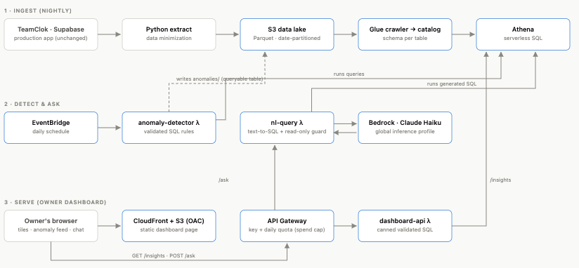

# FleetFlow — Fleet Operations Intelligence on AWS

A serverless analytics + AI layer that sits alongside **TeamClok** (a React Native field-workforce
app backed by Supabase). FleetFlow ingests TeamClok's operational data into an AWS data lake and turns
it into insights the fleet owner can't get from a transactional database:

1. **Analytics data lake** — S3 + Glue + Athena over shifts, fuel, odometer, loads, and payroll data.
2. **Fuel & payroll anomaly detection** — a scheduled Lambda flags likely fuel-card misuse / data-entry
   errors by cross-checking litres logged against odometer distance travelled.
3. **Natural-language analytics assistant** — ask questions in plain English; Claude on Amazon Bedrock
   writes the SQL.
4. **Owner dashboard** — a standalone web app (S3 + CloudFront + API Gateway) with anomaly feed,
   driver-hours / fuel-economy panels, and  "Ask FleetFlow".

---

## Problem

Fleet owners running TeamClok capture every shift, fuel stop, and odometer
reading, but Supabase can't answer questions like *"what's my fuel
cost per unit this quarter?"* or surface a truck logging fuel it couldn't possibly have burned.
FleetFlow closes that gap without touching the production app.

## Architecture

## Cost

Phase 1 is entirely serverless / pay-per-use (S3, Glue, Athena) — a few dollars at demo scale.
A $20 AWS Budget alert guards against surprises.

## Design decisions

- **Text-to-SQL returns the generated SQL with every answer.** The LLM writes SQL, so the query is surfaced for human
  verification. 
- **Read-only guard.** The assistant rejects anything that isn't a single
  `SELECT`/`WITH` statement before it can reach Athena.
- **FleetFlow never touches the production app.** TeamClok (React Native +
  Supabase) is unmodified; FleetFlow is a separate analytics plane that reads
   export. The dashboard is its own S3+CloudFront site.

## Demo Link

https://d3l0clanvkplm9.cloudfront.net/
